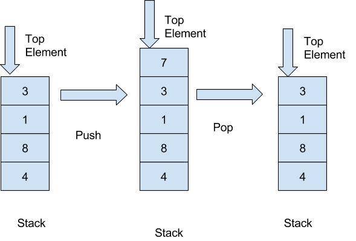

# Stacks
A stack is a linear data structure that follows the Last In, First Out (LIFO) principle. This means that the last element added to the stack is the first one to be removed. Stacks are commonly used in programming for tasks like managing function calls, parsing expressions, and implementing undo/redo functionality

### Key Concepts of a Stack
1. LIFO Principle:

* The last element added to the stack is the first one to be removed.

2. Operations:

* Push: Add an element to the top of the stack.

* Pop: Remove and return the top element from the stack.

* Peek (or Top): Return the top element without removing it.

* IsEmpty: Check if the stack is empty.

* Size: Return the number of elements in the stack.

3. Visualization:

* Think of a stack like a stack of plates. You can only add or remove plates from the top.

### Time Complexity of Stack Operations

##### Operation
* Push -> O(1)
* Pop -> O(1)
* Peek -> O(1)
* IsEmpty -> O(1)
* Size -> O(1)

### Real-World Examples of Stacks
1. Browser History:

* The back button in a browser uses a stack to navigate through previously visited pages.

2. Text Editor Undo/Redo:

* Stacks are used to store changes for undo/redo operations.

3. Call Stack in Programming:

* Function calls are managed using a stack.

4. Expression Evaluation:

* Stacks are used to evaluate arithmetic expressions (e.g., infix, postfix, prefix).

In summary, a stack is a simple yet powerful data structure that follows the LIFO principle. It is widely used in programming for managing data in a last-in, first-out manner.

